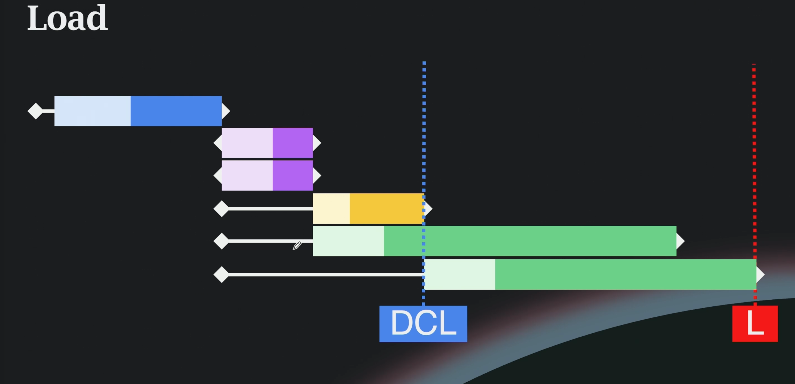
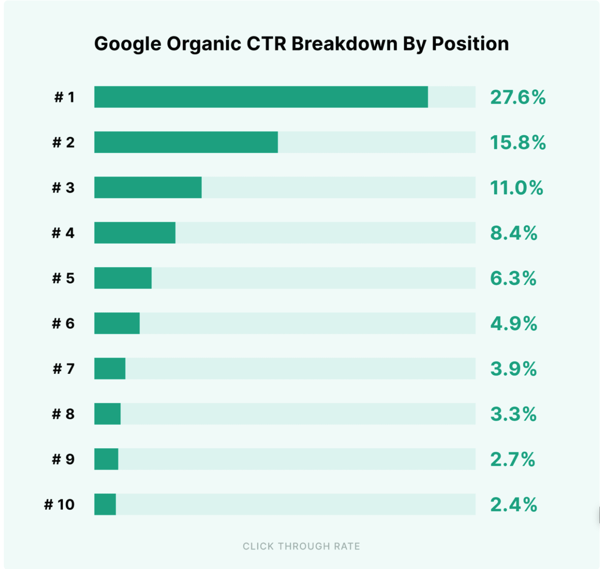
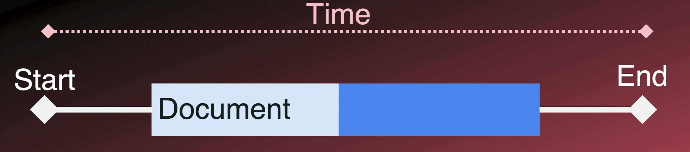
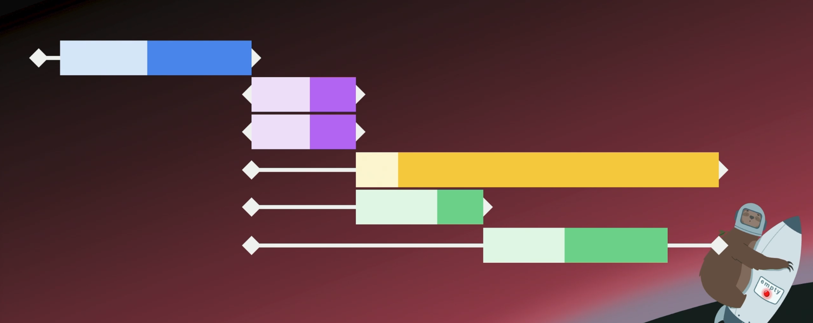
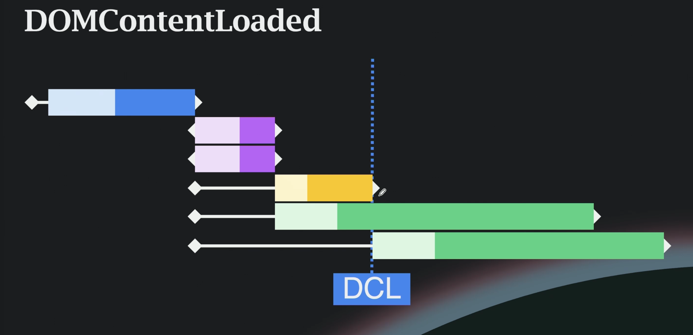

# What is Web Performance?

  It is the speed and efficiency with which a website/web application loads, renders and responds to interractions from visitors.

# What does slow look like?

  - Long time taken for page to load
  - Elemenets jumping around
  - Delays to click responses
  - Slow loading of images and vidoes
  - Laggy scrolling and animations

# Why care about web performance?

  - User Experience:
    Reduce fustration, This is how well the website meets or exceeds user epectations.

    - For effective communication some sort of reqsponse is needed within 2 seconds of a request. A longer wait break s concentration and affects productivity.
      - User expectations (Usability Engineering (Neilsen)):
        - 0.01 seconds: instant
        - 1 second uninterrupted flow
        - 10 break flow, fustration

      - Some useful stats (Time is Money, Everts):
        - 40% of users abandon a site at 3 seconds
        - 75% users that experience a slow site will not return

  - SEO:
    How well you are able to help search engines understand and rank your content.
    [Some Good Stats on CTR](https://backlinko.com/google-ctr-stats)

    - #1 Ranking Page gets 10 times more click than number 10
    

    -  As 2020, Google made it a thing that the performance of your site will impact your site ranking ===> You need to be fast to rank well.

  
  - Common themes: 
    - Increase number of users coming to us, 
    - Reduce number of users leaving,
    - Increase number of users returning

    - i.e we want more users to our app, but why?? CONVERSION

  - Case studies of the impact of web performance optimazation found [here](https://wpostats.com/)

# How do we measure web performance?

  - We use waterfall chart to measure how fast a web app is.

  - It usually shows the lifecycle of a page from the request to full load
  
  
  
  
  
  
  
  - The colors have meaning:
    - Blue: HTML Documents
    - Purple: Stylesheets
    - Yellow: Javascript
    - Green: Images
    - Brown: Fecth/Other
    - Teal: Fonts 

# Legacy Metrics:

  - ## DOMContentLoaded:
    The HTML document had been donwload and deferred scripts have been executed:


    Here the structure of the page is done but images may not be displayed yet.

    ```
      window.addEventListener('DOMContentLoaded', (event) => {
        console.log(`DOMContentLoaded at ${event.timeStamp} ms`)
      })
    ```

    


  - ## Load:
    HTML and all known ressources have been downloaded and rendered. Except those that are lazy loaded.

    Here the spinner on the browser disappears. The document is ready and updates can be done.

    ```
      window.addEventListener('load', (event) => {
        console.log(`DOMContentLoaded at ${event.timeStamp} ms`)
      })
    ```

    

  
# Problem with Legacy Metrics:

  - With the introduction of client-side rendering these 2 metrics above mean nothing because the document loaded into the browser is empty,
  the two events would happen right away, thus telling us nothing about the page performance.


# Core Web Vitals:
  Newer metrics introduced by Google to abjectively measure perfomance regardless of the tech used for your app.

  The really measure 3 things mainly:
    - How fast your site visibly loads: Largest Contentful Paint(LCP)

      How fast does your site visibly load the most important element.

      How do we deceide the most important thing? Well we dont!! Google considers the larget element by pixel area on the page to be the most important,

      With some rules of course:
        - Cannot have an 0 opacity,
        - Size whould be less 100%
        - Does not count for Low entropy Images < 0.05: Entropy is Size(Mb) / number of pixel displaying (440 * 400 for example)

      - Guidelines: This should be less 2.5s and not beyond 4s

    - How smooth things load: Cumulative Layout Shift(CLS)

      How smooth and predictably elements load into the page.

      This is measured by taking impact-fraction = impact-size / viewport height, impact height = how many rows of pixels have to change in the shift
      distance-fraction = height of new element / viewport

      CLS = impact-size * distance-fraction

      0.1 or less is good, 0.25 above is poor.

      Skeletons/placeholders are the best way to improve CLS.

    - How quickly users can interract with the page: Interaction to Next Paint(INP)


# How to capture perfomance metrics

  - # Performance API:
    API available in the browser to help measure performance related things:
      - ```now()```: Returns a high resolution timestamp relative to the moment the page started, i.e. the time of the first GET request made by the browser in response to a user redirect.

      - ```timeOrigin```: Return the actual timestamp at which the page started.

      - ```getEntries()```: A bunch of performance metrics analytics, **Dig Further Into This**

  - # Performance Observer:
    The issue with performance API is that while we add custom code to measure performance, this code actuallu affects our metrics, so way we avoid this is through the use of observers,
    ```
      const performanceObserver = new PerformanceObserver((list, observer) =>{
        list.getEntries().forEach((entry) => {
          console.log(`Layout shifted by ${entry.value}`);
        })
      })

      performanceObserver.observe({type: 'layout-shift', bufferred: true})

      // buffered: true to make sure we get the entire historic of this event...
    ```

    We can also use package like ```web-vitals```, and subscribe to well defined event such as:
    ```
      import { onLCP, onCLS, onINP} from 'web-vitals';

      onLCP(console.log) // This will log the captured LCP metrics to the console...
    ```


# Performance Test:
  We have 3 main categories of test we can run:
  - # Lab Data: 
    Typically run on somedevice close to the server or on the server itself(local machine), this is usally done for diagnotic purpose and should not be considered user experience.

  - # Synthetic Data:
    Typically run on some other remote device/server, some dedicated service from which we request to go and run perfomance metrics.

  - # Field Data:
    This is actually the recording of performance metrics from the users device. this actually is the real view of what the user experience is like. And this usually gives more data point rather than just single instance tests from the above two.

  - # Maximizing Lab Data:
    To run better diagnotics test, we can run our test by simulating various factor on the browser to be a little more close to what that users are experiencing:
    - Mobile vs Desktop Screen Sizes
    - Network Conditions (Network Throttle)
    - Processing Power (CPU Throttling)